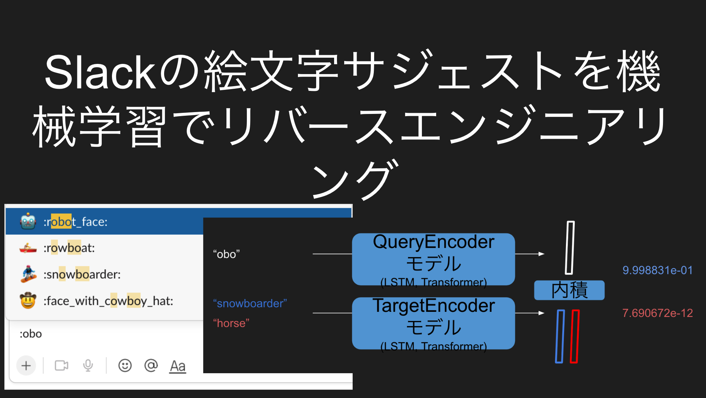

# learn_slack_emoji_completion





## Train

```
poetry install
poetry run python train.py --lr=1e-3 --weight_decay=0 --num_epoch=10000 --batch_size=50 --save_interval_epoch=100 --enable_hard_negative=True --model_type=lstm --dropout=0 --enable_wandb=True --output_type=last --train_ratio=0.8 --num_layers=2 --name_prefix=l2_
```
